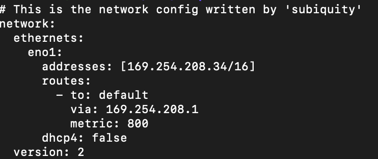
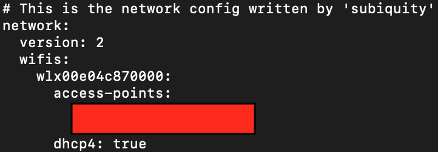

# Ubuntu Server Config
## This clust will make up of one Mac and two ubuntu server (one has GPU, another don't have GPU)
### Installation of Ubuntu Server Edition
- HP server without GPU
  1. Following the Install Wizard; 
   (**Note: Choosing the network device **that can **connect** to the** internet if you have more than one network device**)
  2. Installing the OpenSSH-server while you install the Ubuntu;
  3. Network Config
       - Make sure you have **sudo** permission
       - Backup the original network config files
           ```bash
           $ sudo cp -r /etc/netplan/00-installer-config.yaml /etc/netplan/00-installer-config.yaml.bak
           #In Ubuntu Server 22.04 LTS the wifi config is a seperate config file, you also can set wifi and ethernet in one config file
           $ sudo cp -r /etc/netplan/00-installer-config-wifi.yaml /etc/netplan/00-installer-config-wifi.yaml
           ``` 
        - Set Static IP address for Ethernet (In this condition the HP server will use ethernet for the inner network and wifi for the internet)
           -  Editing the /etc/netplan/00-installer-config.yaml 
           ```bash
           $ sudo vi /etc/netplan/00-installer-config.yaml
           # Note you need to pay more attention to the structure of yaml file, especially the space
           ```
           After configuring the 00-installer-config.yaml is shown in the following figure.
           
           Where addresses are the static IP addresses you will use, and use routes to set the gateway. The metric property is used to set the priority of the network device, the bigger number means low priority, and vice versa. In this condition, we set a bigger number of metric than the WiFi device.
       - Set Wi-Fi for internet
                
         Changing wlx00e04c870000 to your wifi device name.
         ```bash
         access-points:
             [Your Wifi Name]:
                 password: XXXX
         ```
        - After all editing, Run:
            ```bash
            sudo netplan apply
            ```
  4. LVM extend storage (Optionanl) 
    
  5. Install & Configure k8s
      - Install docker
      ```bash
        sudo apt install docker.io
        sudo systemctl enable docker
        sudo systemctl start docker
        sudo systemctl status docker
        #sudo systemctl start docker
      ```  
      - Install Kubernetes
        
        ```bash
        #Disable the SWAP partition
        sudo swapoff -a
        sudo rm /swap.img
        #edit /etc/fstab -> delete /swap.img none swap sw 0 0
    
        sudo apt-get update
        sudo apt-get install -y apt-transport-https ca-certificates curl
        sudo curl -fsSLo /etc/apt/keyrings/kubernetes-archive-keyring.gpg https://packages.cloud.google.com/apt/doc/apt-key.gpg
        echo "deb [signed-by=/etc/apt/keyrings/kubernetes-archive-keyring.gpg] https://apt.kubernetes.io/ kubernetes-xenial main" | sudo tee /etc/apt/sources.list.d/kubernetes.list
        sudo apt-get update
        sudo apt-get install -y kubelet kubeadm kubectl
        sudo apt-mark hold kubelet kubeadm kubectl
        ```
     - Set Hostname
        ```bash
        #Master Node
        sudo hostnamectl set-hostname master-node
        #edit /etc/hosts
        ip_adress master-node
        #Work node
        sudo hostnamectl set-hostname w1
        ```

     - Install Containerd Follow the [link](https://github.com/containerd/containerd/edit/main/docs/getting-started.md)
       **Note** On ubuntu, the containerd.service will be placed under /lib/systemd/system
     - Disable the UFW for ubuntu's firewalld
        ```bash
        sudo systemctl stop ufw
        ``` 
     - Initialize Kubernetes on Master Node
       ```bash
       sudo kubeadm init --pod-network-cidr=169.254.208.33/16
       #Set your own IP addresses 
       ```

    
Reference: 

1. https://www.letscloud.io/community/how-to-install-kubernetesk8s-and-docker-on-ubuntu-2004
2. https://kubernetes.io/docs/setup/production-environment/tools/kubeadm/install-kubeadm/